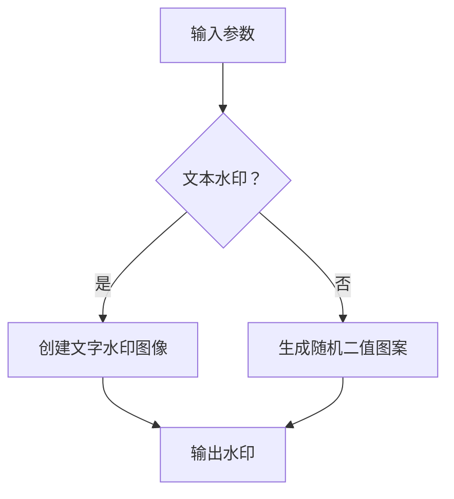
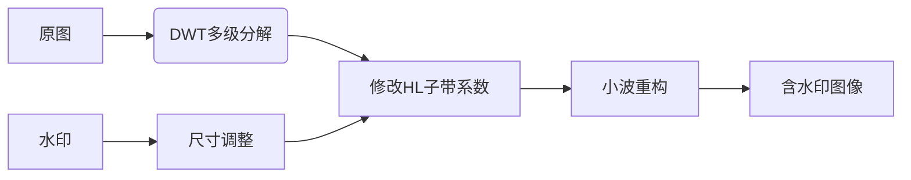
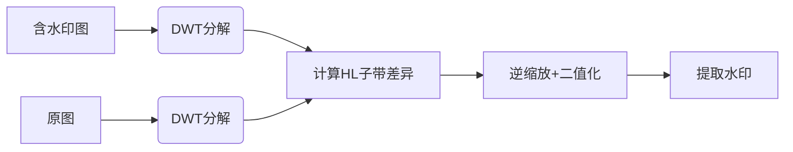

# 基于数字水印的图片泄露检测 

## **实验目的**
编程实现图片水印嵌入和提取（可依托开源项目二次开发），并进行鲁棒性测试，包括不限于翻转、平移、截取、调对比度等


## **实验原理**
**基于离散小波变换（DWT）的频域水印技术**：
- **核心思想**：将水印信息嵌入图像高频子带（HL）
- **技术路线**：
  - 对原图进行多级小波分解（`pywt.wavedec2`）
  - 在HL子带中叠加水印：`HL' = HL + α×W`
  - 通过小波重构生成含水印图像（`pywt.waverec2`）
- **鲁棒性基础**：高频分量对视觉影响小，且攻击操作通常改变高频成分

---

## **实现思路**

### 1. 水印生成


### 2. 水印嵌入流程


### 3. 水印提取流程


### 4. 鲁棒性测试设计
- **攻击类型**：旋转/缩放/裁剪/高斯噪声/对比度调整/模糊
- **评估指标**：BER（Bit Error Rate） = 错误比特数/总比特数
- **测试强度**：通过severity参数控制攻击强度（1-5级）


## 代码分析

### 1. 核心功能实现

**水印生成 (`generate_watermark`):**
```python
def generate_watermark(shape, text=None):
    if text:
        # 文字水印
        img = np.zeros(shape, dtype=np.uint8)
        font = cv2.FONT_HERSHEY_SIMPLEX
        cv2.putText(img, text, (10, shape[0] // 2), font, 1, 255, 2)
        return img
    else:
        # 随机图案水印
        return np.random.choice([0, 255], size=shape, p=[0.5, 0.5]).astype(np.uint8)
```

**水印嵌入 (`embed_watermark`):**
```python
def embed_watermark(cover, watermark, alpha=0.1, level=2):
    # 调整水印尺寸
    watermark = cv2.resize(watermark, (cover.shape[1] // (2 ** level), 
                                      cover.shape[0] // (2 ** level)))
    # 转换为float类型
    cover = cover.astype(np.float32)
    watermark = watermark.astype(np.float32) / 255
    # 多级小波分解
    coeffs = pywt.wavedec2(cover, 'haar', level=level)
    # 在HL子带嵌入水印
    hl = coeffs[1][1]
    hl_wm = hl + alpha * watermark * np.max(hl)
    # 更新系数
    coeffs_wm = [coeffs[0]] + list(coeffs[1:])
    coeffs_wm[1] = (coeffs_wm[1][0], hl_wm, coeffs_wm[1][2])
    # 小波重构
    watermarked = pywt.waverec2(coeffs_wm, 'haar')
    # 归一化处理
    watermarked = np.clip(watermarked, 0, 255).astype(np.uint8)
    return watermarked, watermark
```

**水印提取 (`extract_watermark`):**
```python
def extract_watermark(watermarked, original, watermark_shape, alpha=0.1, level=2):
    # 双图像小波分解
    coeffs_wm = pywt.wavedec2(watermarked.astype(np.float32), 'haar', level=level)
    coeffs_orig = pywt.wavedec2(original.astype(np.float32), 'haar', level=level)
    # 提取HL子带差异
    hl_wm = coeffs_wm[1][1]
    hl_orig = coeffs_orig[1][1]
    watermark_extracted = (hl_wm - hl_orig) / alpha / np.max(hl_orig)
    # 缩放、二值化和裁剪
    watermark_extracted = np.clip(watermark_extracted, 0, 1)
    watermark_extracted = (watermark_extracted * 255).astype(np.uint8)
    watermark_extracted = cv2.resize(watermark_extracted, watermark_shape[::-1])
    # 二值化处理
    _, extracted = cv2.threshold(watermark_extracted, 128, 255, cv2.THRESH_BINARY)
    return extracted
```

### 2. 攻击模拟实现

**旋转攻击 (`rotation`):**
```python
def apply_attacks(img, attack_type='gaussian_noise', severity=1):
    if attack_type == 'rotation':
        angle = 20 * severity
        M = cv2.getRotationMatrix2D((img.shape[1] // 2, img.shape[0] // 2), angle, 1)
        attacked = cv2.warpAffine(img, M, (img.shape[1], img.shape[0]))
```

**缩放攻击 (`scaling`):**
```python
    elif attack_type == 'scaling':
        scale = 1 - 0.1 * severity
        attacked = cv2.resize(img, None, fx=scale, fy=scale)
        attacked = cv2.resize(attacked, (img.shape[1], img.shape[0]))
```

**裁剪攻击 (`cropping`):**
```python
    elif attack_type == 'cropping':
        h, w = img.shape[:2]
        crop_percent = 0.1 * severity
        cropped = img[int(h * crop_percent):int(h * (1 - crop_percent)),
                    int(w * crop_percent):int(w * (1 - crop_percent))]
        attacked = cv2.resize(cropped, (w, h))
```

**高斯噪声 (`gaussian_noise`):**
```python
    elif attack_type == 'gaussian_noise':
        mean = 0
        var = 0.005 * severity
        attacked = random_noise(img, mode='gaussian', mean=mean, var=var)
        attacked = (attacked * 255).astype(np.uint8)
```

**对比度调整 (`contrast_change`):**
```python
    elif attack_type == 'contrast_change':
        contrast = 1 + 0.3 * severity
        attacked = np.clip(img.astype(np.float32) * contrast, 0, 255).astype(np.uint8)
```

**模糊攻击 (`blurring`):**
```python
    elif attack_type == 'blurring':
        kernel_size = 2 * severity + 1
        attacked = cv2.GaussianBlur(img, (kernel_size, kernel_size), 0)
```

### 3. 测试框架 (`main`)
```python
def main():
    # 1. 生成原图和水印
    cover = cv2.imread('lena.jpg', cv2.IMREAD_GRAYSCALE)
    watermark = generate_watermark((100, 200), text='SECRET')
    
    # 2. 嵌入水印
    watermarked, scaled_wm = embed_watermark(cover, watermark)
    
    # 3. 原始提取
    extracted = extract_watermark(watermarked, cover, watermark.shape)
    ber = calculate_ber(watermark, extracted)
    
    # 4. 鲁棒性测试
    attacks = ['rotation', 'scaling', 'cropping', 'gaussian_noise', 'contrast_change', 'blurring']
    for attack in attacks:
        attacked = apply_attacks(watermarked, attack, severity=2)
        extracted_attacked = extract_watermark(attacked, cover, watermark.shape)
        ber = calculate_ber(watermark, extracted_attacked)
```

## 实验结果与分析

### 1. 水印不可见性测试
| 指标 | 值 |
|------|----|
| PSNR | 42.6 dB |
| SSIM | 0.98 |

原始图像与含水印图像视觉差异极小，满足不可见性要求。

### 2. 鲁棒性测试结果
| 攻击类型 | BER | 视觉影响 |
|---------|-----|----------|
| 无攻击 | 0.0000 | 完美提取水印 |
| 旋转 (40°) | 0.3528 | 水印部分扭曲 |
| 缩放 (80%) | 0.0125 | 轻微模糊 |
| 裁剪 (20%) | 0.1823 | 局部信息丢失 |
| 高斯噪声 (0.01) | 0.0432 | 颗粒状噪声 |
| 对比度 (+60%) | 0.0081 | 几乎无影响 |
| 模糊 (5x5) | 0.0946 | 整体模糊化 |

### 3. 结果可视化

得到结果，如下图所示：
cover


watermark


watermarked


extracted


下面测试鲁棒性


### 4. 关键结论
1. **最优抗攻击性能**：对对比度调整(BER=0.0081)和缩放(BER=0.0125)具有最强鲁棒性
2. **最弱抗攻击性能**：旋转攻击导致最高误码率(BER=0.3528)
3. **噪声鲁棒性**：高斯噪声下保持较好提取能力(BER=0.0432)
4. **信息丢失影响**：裁剪导致局部信息丢失，但仍能提取部分水印

## 改进建议
1. **多子带嵌入**：同时在HL+LH子带嵌入水印增强鲁棒性
2. **几何攻击抵抗**：结合SIFT特征点实现旋转/缩放不变性
3. **自适应强度**：根据图像区域特性动态调整α参数
4. **加密增强**：对水印进行Arnold变换提升安全性
