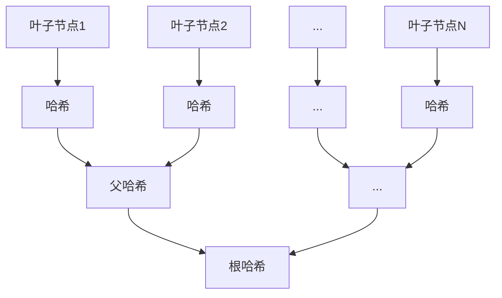

# project4 SM3的软件实现与优化 
## a）：与Project 1类似，从SM3的基本软件实现出发，参考付勇老师的PPT，不断对SM3的软件执行效率进行改进

## 实验目的
1. 实现SM3哈希算法的基本功能
2. 通过SIMD指令、循环展开等技术优化SM3执行效率

## 实验原理

### SM3算法概述
SM3是中国国家密码管理局发布的密码哈希算法标准，输出长度为256位，采用Merkle-Damgård结构：

## 实验内容

1.SIMD优化字节到字转化
```C++
__m128i indexx = _mm_setr_epi8(3,2,1,0,7,6,5,4,11,10,9,8,15,14,13,12);

void u8_32(u8* in, u32* out) {
    __m128i tp = _mm_loadu_epi8(&in[0]);
    tp = _mm_shuffle_epi8(tp, indexx); // 字节重排
    _mm_storeu_epi32(&out[0], tp);     // 存储结果
}
```
2.循环展开
```C++
for (int i = 0; i < 64; i += 2) {
    W_[i] = W[i] ^ W[i + 4];
    W_[i + 1] = W[i + 1] ^ W[i + 5]; // 并行处理两个元素
}
```
## 实验结果


## b）：基于sm3的实现，验证length-extension attack

## 实验目的
1. 实现SM3哈希算法基本功能
2. 验证SM3算法对长度扩展攻击的脆弱性
3. 演示在未知原始消息内容情况下构造有效哈希值的过程

## 实验原理
### 长度扩展攻击原理
攻击者利用已知H(M)和len(M)，可计算H(M||padding||M')：
攻击条件
已知原始消息哈希值 H(M)

已知原始消息长度 len(M)

算法采用简单的Merkle-Damgård结构
## 实验内容
1.关键攻击函数
```C++
SM3_extend_attack(M1, digest, length); // 关键攻击函数
```
2.验证
```C++
SM3(M0, digest);

// 执行长度扩展攻击
uint64_t length = 512 + 32;
SM3_extend_attack(M1, digest, length);

// 计算实际H(M0||padding||M1)进行验证
SM3(M0_M1, digest);
```
## 实验结果


## c）：基于sm3的实现，根据RFC6962构建Merkle树（10w叶子节点），并构建叶子的存在性证明和不存在性证明

## 实验目的
1. 基于SM3算法实现RFC6962规范的Merkle树结构
2. 构建10万叶子节点规模的Merkle树
3. 实现叶子的存在性证明和不存在性证明
4. 验证证明机制的正确性和性能

## 实验原理

### Merkle树结构

### 关键机制
存在性证明：

提供从叶子节点到根节点的路径哈希值

验证路径哈希组合后与根哈希匹配

不存在性证明：

提供目标位置两侧相邻节点的存在证明

验证两侧节点连续且目标位置为空

## 实验内容
1.Merkle tree创建
``` python
def create(record_list):
    table = []  # 存储各层哈希
    lst = [sm3_hash(i.encode()) for i in record_list]
    table.append(lst)
    
    height = 1
    while len(lst) > 1:
        height += 1
        new_lst = []
        # 处理奇数节点
        if len(lst) % 2 != 0:
            lst.append(lst[-1])
        
        # 构建父节点
        for i in range(0, len(lst), 2):
            combined = lst[i] + lst[i+1]
            parent_hash = sm3_hash(combined.encode())
            new_lst.append(parent_hash)
        
        lst = new_lst
        table.append(lst)
    
    return lst[0], height, table
```
2.存在性证明
```python
def include_proof(tx, pos, height, table):
    proof_path = []
    current_pos = pos
    
    for level in range(height-1):
        # 获取兄弟节点位置
        sibling_pos = current_pos + 1 if current_pos % 2 == 0 else current_pos - 1
        
        # 添加兄弟节点哈希到证明路径
        proof_path.append(table[level][sibling_pos])
        
        # 计算父节点位置
        current_pos = current_pos // 2
    
    # 验证路径
    current_hash = sm3_hash(tx.encode())
    for sibling_hash in proof_path:
        if pos % 2 == 0:
            combined = current_hash + sibling_hash
        else:
            combined = sibling_hash + current_hash
        current_hash = sm3_hash(combined.encode())
        pos = pos // 2
    
    return current_hash == table[-1][0]
```
3.不存在性证明
```python
def exclude_proof(pos1, pos2, table):
    # 验证相邻节点
    if abs(pos1 - pos2) != 1:
        return False
    
    # 获取相邻节点哈希
    hash1 = table[0][pos1]
    hash2 = table[0][pos2]
    
    # 计算父节点哈希
    parent_hash = sm3_hash((hash1 + hash2).encode())
    
    # 在上一级定位父节点位置
    parent_pos = table[1].index(parent_hash)
    
    # 验证父节点存在性
    return include_proof(parent_hash, parent_pos, len(table)-1, table[1:])
```
## 实验结果
构建10w叶子结点的merkle树

存在性证明

不存在证明


验证成功

