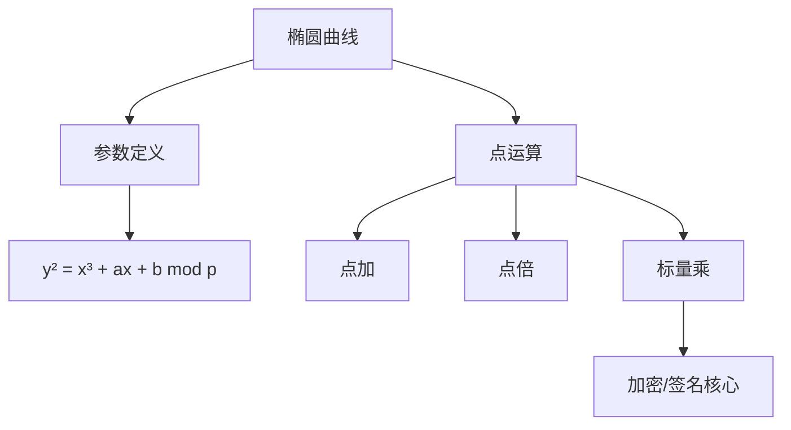

##  project5：SM2的软件实现优化 

a). 考虑到SM2用C 语言来做比较复杂，大家看可以考虑用python来做 sm2的 基础实现以及各种算法的改进尝试
## 实验目的
1. 实现SM2国密算法的核心功能（密钥生成、加密、解密、签名、验签）
2. 优化椭圆曲线点运算效率
3. 增强算法安全性和异常处理能力
4. 验证算法在各种场景下的正确性

## 实验原理

### SM2算法基础

### 核心操作
1.加密流程
``` python
C1 = [k]G
S = [k]P
t = KDF(x₂||y₂, len(msg))
C2 = M ⊕ t
C3 = Hash(x₂||M||y₂)
```
2.签名流程
``` python
Z_A = Hash(ENTL||ID||a||b||Gx||Gy||Px||Py)
e = Hash(Z_A||M)
r = (e + x₁) mod n
s = (1+d_A)⁻¹ * (k - r*d_A) mod n
```

## 实验内容
可以考虑尝试蒙哥马利、点乘算法优化以及并行运算优化等等优化措施：
点乘算法优化：
``` python
def naf_window_mult(k, point, a, p, w=5):
    # 预计算表
    table = [None] * (1 << (w-1))
    table[0] = point
    for i in range(1, 1 << (w-1)):
        table[i] = point_add(table[i-1], point, a, p)
    
    # NAF转换
    naf = []
    while k:
        if k & 1:
            t = 2 - (k % 4)
            k -= t
            naf.append(t)
        else:
            naf.append(0)
        k //= 2
    
    # NAF计算
    result = (0, 0)
    for i in reversed(naf):
        result = point_add(result, result, a, p)
        if i > 0:
            result = point_add(result, table[i//2], a, p)
        elif i < 0:
            result = point_add(result, neg_point(table[-i//2], p), a, p)
    return result
```
原始结果

集成优化之后的结果


## b). 20250713-wen-sm2-public.pdf 中提到的关于签名算法的误用 分别基于做poc验证，给出推导文档以及验证代码
### 1）相同用户重用随机数k
s1 = k⁻¹(e1 + d·r) mod n

s2 = k⁻¹(e2 + d·r) mod n

=> k = (e1 - e2)/(s1 - s2) mod n

=> d = (s1·k - e1)/r mod n
```python
def scenario1_reuse_k():
    # 用户1使用相同k对两条消息签名
    r1, s1 = ecdsa_sign(n, G, d1, k, e1)
    r2, s2 = ecdsa_sign(n, G, d1, k, e2)
    
    # 恢复nonce k
    k_rec = (e1 - e2) * inv(s1 - s2, n) % n
    
    # 恢复私钥d
    d_rec = (s1 * k_rec - e1) * inv(r1, n) % n
```

### 2）不同用户使用相同k
s1 = k⁻¹(e1 + d1·r1) mod n

s2 = k⁻¹(e2 + d2·r2) mod n

=> k = (e1 - e2)/(s1 - s2) mod n

=> d1 = (s1·k - e1)/r1 mod n

=> d2 = (s2·k - e2)/r2 mod n
```python
def scenario2_different_users_same_k():
    # 用户1签名
    r1, s1 = ecdsa_sign(n, G, d1, k, e1)
    # 用户2签名
    r2, s2 = ecdsa_sign(n, G, d2, k, e2)
    
    # 恢复nonce k
    k_rec = (e1 - e2) * inv(s1 - s2, n) % n
    
    # 恢复两个私钥
    d1_rec = (k_rec * s1 - e1) * inv(r1, n) % n
    d2_rec = (k_rec * s2 - e2) * inv(r2, n) % n
```

### 3）与ECDSA公用（d，k）
ECDSA: s_ecdsa = k⁻¹(e + d·r) mod n

Schnorr: s_schnorr = (k + e_schnorr·d) mod n

=> d = (s_schnorr·s_ecdsa - e)/(r + e_schnorr·s_ecdsa) mod n
``` python
def scenario3_shared_dk():
    # ECDSA签名
    r_ecdsa, s_ecdsa = ecdsa_sign(n, G, d1, k, e1)
    # Schnorr签名
    r_schnorr, s_schnorr, e_schnorr = schnorr_sign(m1, n, G, d1, k)
    
    # 恢复私钥d
    numerator = (s_schnorr * s_ecdsa - e1) % n
    denominator = (r_ecdsa + e_schnorr * s_ecdsa) % n
    d_rec = numerator * inv(denominator, n) % n
```
### 4）k值泄漏
s = k⁻¹(e + d·r) mod n

=> d = (s·k - e)/r mod n
``` python
def scenario4_k_leakage():
    # ECDSA签名
    r, s = ecdsa_sign(n, G, d1, k, e1)
    
    # 直接恢复私钥d
    d_rec = (s * k - e1) * inv(r, n) % n
```

代码验证得到，四个签名误用都会导致密钥泄露


## c). 伪造中本聪的数字签名,Satoshi签名伪造

## 实验目的
1. 演示ECDSA签名算法的安全漏洞
2. 实现Satoshi签名伪造攻击
3. 验证无消息签名伪造的可行性
4. 分析数字签名系统的安全边界

## 实验原理

### ECDSA签名机制
签名生成过程：
1. **计算消息哈希**  
   $$e = HASH(m)$$
   - 使用加密哈希函数（如SHA-256）处理消息
   
2. **生成随机数**  
   $$k \in [1, n-1]$$  
   - n是椭圆曲线基点G的阶数

3. **计算曲线点**  
   $$(x₁, y₁) = k \cdot G$$

4. **计算r值**  
   $$r = x₁ \mod n$$  
   - 如果r=0则重新选择k

5. **计算s值**  
   $$s = k^{-1}(e + d \cdot r) \mod n$$  
   - d为签名者私钥
   - k⁻¹是k模n的乘法逆元

6. **输出签名**  
   $$(r, s)$$  
   - 如果s=0则重新选择k

## 签名验证过程
1. **参数有效性检查**  
   $$r \in [1, n-1], s \in [1, n-1]$$

2. **计算消息哈希**  
   $$e = HASH(m)$$

3. **计算逆元**  
   $$w = s^{-1} \mod n$$

4. **计算中间参数**  
   $$u₁ = e \cdot w \mod n$$  
   $$u₂ = r \cdot w \mod n$$

5. **计算曲线点**  
   $$(x₂, y₂) = u₁ \cdot G + u₂ \cdot Q$$  
   - Q为签名者公钥（Q = d·G）

6. **验证签名**  
   $$r \equiv x₂ \pmod{n}$$
$$ P = u_1 \cdot G + u_2 \cdot Q $$
$$ = (e \cdot w)G + (r \cdot w)Q $$
$$ = w(e \cdot G + r \cdot Q) $$
$$ = s^{-1}(e \cdot G + r \cdot (d \cdot G)) $$
$$ = s^{-1}(e + r \cdot d)G $$
$$ = k \cdot G $$


∵ $s = k^{-1}(e + d \cdot r)$  
∴ $k = s^{-1}(e + d \cdot r)$  
⇒ $P = k \cdot G$  
最终 $x₂ \equiv x₁ \pmod{n} \Rightarrow r \equiv x₂ \pmod{n}$


## 实验内容
1.签名伪造
``` python
def pretend(n, G, P):
    """Satoshi无消息签名伪造"""
    u = random.randint(1, n-1)
    v = random.randint(1, n-1)
    
    # 构造临时点
    R_point = add(p_mul_n(u, G), p_mul_n(v, P))
    r = R_point[0] % n
    
    # 计算伪造参数
    v_inv = mul_inv(v, n)
    e1 = (r * u * v_inv) % n
    s1 = (r * v_inv) % n
    
    return e1, r, s1
```
## 实验结果


